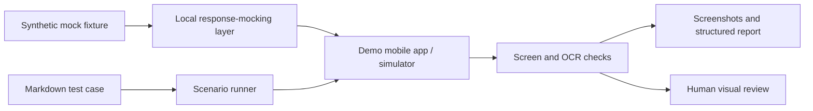

# Fintech UI Test Scenarios

Sanitized portfolio case study of an AI-assisted iOS UI-testing workflow designed
and developed by **Ruslan Iusupov** for a mobile-banking product.

> This is an independent public reconstruction, not an official product
> repository. It demonstrates the testing approach without exposing company
> source code, internal infrastructure, credentials, real customer data, or
> production artifacts.

## The problem

Mobile-banking teams need to validate states that are difficult, slow, or unsafe
to reproduce with real accounts: overdue payments, unavailable limits, blocked
users, interrupted identity checks, and multi-step money flows.

The original workflow made those states repeatable by describing the test in
plain text, supplying controlled mock responses, interacting with an iOS
Simulator, and collecting evidence in a consistent report.

## Public architecture



## What the approach demonstrates

- **Scenario-as-code:** a QA engineer can review and change a test without
  editing application source code.
- **Deterministic rare states:** synthetic fixtures make negative and edge cases
  repeatable.
- **Fast text checks:** OCR can validate copy and basic presence/absence rules.
- **Honest visual boundary:** colour, icons, layout, and enabled/disabled states
  still require image-based or human review.
- **Evidence by default:** each run is designed to produce a step table,
  screenshots, and a concise verdict.
- **Safety boundary:** no real transfer, credit, payment, or identity action is
  completed by the automated flow.

## Repository contents

```text
cases/
  installment_limit_status_matrix.md   representative scenario
mocks/
  installment_limit_available.json     synthetic response fixture
  installment_limit_overdue.json       synthetic negative-state fixture
reports/
  sample_report.md                      example evidence format
docs/
  design-decisions.md                   approach and trade-offs
  public-scope.md                       what was intentionally excluded
scripts/
  validate_repository.py                JSON and local-link quality gate
tests/
  test_public_examples.py               checks for synthetic fixture behaviour
```

## Representative flow

1. Select a synthetic backend state.
2. Open the relevant screen in a demo/simulator environment.
3. Verify visible copy within a defined screen region.
4. Check that content forbidden for the selected state is absent from the full
   screen.
5. Review visual-only properties separately.
6. Record expected vs. actual behaviour and attach evidence.

See [the sample status-matrix case](cases/installment_limit_status_matrix.md) and
[the sample report](reports/sample_report.md).

## What is intentionally not included

- the bank application's source code or build configuration;
- internal repository locations, hosts, endpoint paths, bundle identifiers, or
  feature flags;
- recorded sessions, screenshots, logs, device identifiers, or employee paths;
- real or test credentials, PINs, SMS codes, tokens, headers, or client records;
- raw company fixtures, response schemas, or internal documentation.

The original archive is therefore **not** published as a ZIP. This repository
keeps the portfolio value while respecting confidentiality and security.

## Status

This public edition is documentation-first. The fixtures and reports are fully
synthetic examples; they are intended to communicate test design, not to connect
to a live or company-owned application.

Validate the public examples locally with:

```bash
python scripts/validate_repository.py
python -m unittest discover -s tests -v
```

## Author

Ruslan Iusupov — [GitHub](https://github.com/ruslaniusupovwork)
